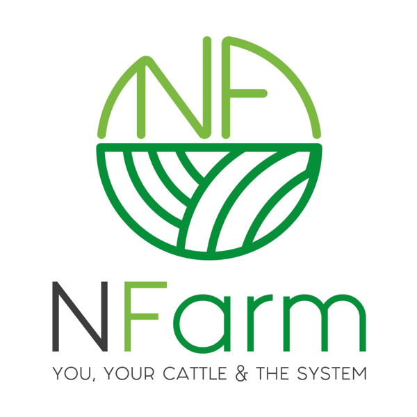

# USE CASE REPORT
**Software Engineer 8A BIS**

**Teacher:** Alondra Ramos

**Students:**
- Luis Fernando Cabral Tamayo
- Esteban Pereda Soria
- Alejandra Katherina Corrales Muro
- José Arturo Claudio Barrios
- Paul Obed Vega Soto

# INTRODUCTION
## GITHUB
Github has revolutionised the way software projects are maintained and collaborated upon, providing developers with an invaluable platform for streamlined software maintenance. With its versatile range of features and tools, Github has become an indispensable asset for teams and individuals alike, empowering them to efficiently manage, track, and update their projects. Whether it's bug fixes, feature enhancements, or version control, Github offers a comprehensive set of functionalities that enhance the software maintenance process and foster collaboration among developers.
1. **Version Control**:  GitHub provides powerful version control capabilities, allowing us to track changes, collaborate, and manage different versions of the software. For a project like this, where data related to the life process of cows is being tracked, having a robust version control system ensures that the project remains transparent and can be easily reverted to previous versions if needed.
2. **Documentation and Issue Tracking**: GitHub provides a variety of tools for documenting code, managing issues, and tracking project progress. These features are crucial for maintaining a comprehensive record of the software's functionality, documenting the development process, and addressing any bugs or feature requests that may arise.
3. **Security and Reliability**: GitHub offers robust security features, such as encrypted connections, two-factor authentication, and access control mechanisms. These measures help protect the project's source code, data, and associated intellectual property from unauthorised access. Given the sensitive nature of the data being tracked, ensuring the security and reliability of the software is essential.
4. **Continuous Integration and Deployment**: GitHub integrates seamlessly with various continuous integration and deployment tools, enabling automated testing, code reviews, and deployment workflows. This helps maintain the project's stability and reliability by automating keys. Regular updates and improvements can be implemented efficiently, ensuring that the software remains up-to-date and capable of tracking the evolving life process of cows accurately.

## MONDAY
Effective project management is crucial for the successful maintenance of software systems. It involves planning, organizing, and executing tasks to ensure timely delivery, efficient resource allocation, and collaboration among team members. **Monday** is a versatile project management tool that offers numerous features and benefits, making it an excellent choice for managing software maintenance projects.

1. **Task and Project Tracking**: Monday provides a visual and intuitive interface for creating and tracking tasks and projects. It allows you to break down complex software maintenance activities into smaller, manageable tasks.

2. **Collaboration and Communication**: Successful software maintenance requires effective collaboration and communication among team members. Monday offers features such as activity streams, comments, and mentions, facilitating real-time discussions, updates, and feedback.

3. **Resource Management**: Software maintenance projects often involve multiple resources, such as developers, testers, and system administrators. Monday allows you to allocate and manage resources efficiently. You can assign tasks to team members, set due dates, and monitor their workload.

4. **Time and Schedule Management**: Meeting deadlines is crucial in software maintenance, as it often involves resolving issues or deploying updates promptly. Monday enables us to create project timelines, set milestones, and establish dependencies between tasks.

5. **Reporting and Analytics**: Monday provides reporting and analytics capabilities that help you track project performance and identify areas for improvement. You can generate visual reports, analyze task completion rates, monitor team productivity, and evaluate project progress against set goals.

6. **Integration and Customization**: Monday integrates with a wide range of third-party tools commonly used in software development and maintenance. For instance, it can be integrated with code repositories, issue tracking systems, and communication platforms.

Monday offers a comprehensive set of features that make it a suitable project management tool for software maintenance projects. Its task and project tracking capabilities, collaboration and communication features, resource management functionalities, time and schedule management tools, reporting and analytics capabilities, and integration options provide a robust framework for effectively managing software maintenance tasks.

# METHODOLOGY
## PROJECT UPLUODING TO GITHUB

## MANAGEMENT ENVIRONMENT

# REFERENCES
Raymond, D. (2023). The Pros and Cons of Using Monday.com Software. Articles for Project Managers - the Project Management Network. https://projectmanagers.net/the-pros-and-cons-of-using-monday-com-software/

Seymour, S. (2023, May 21). Why will monday.com work great for any company? Monday.com will work great for any company because it uses a v. Financesonline.com. https://financesonline.com/reasons-why-monday-com-will-work-great-for-any-company/
